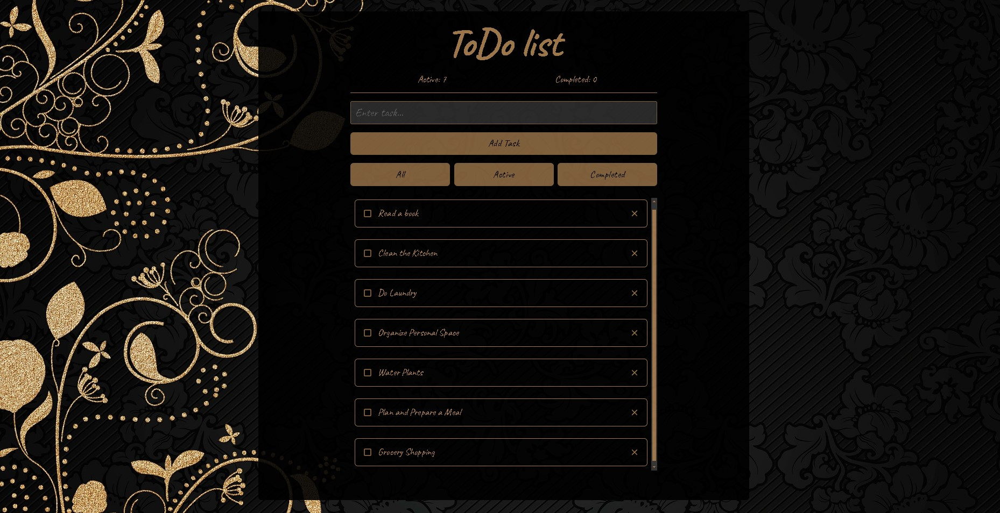

 
  
  
&#xa0;

<h1 align="center">TODO List App</h1>

## Description:

[TODO List App](https://github.com/Maryna-Korbet/todo-app) is a simple, fully
functional TODO list application built using the latest version of **React.js**
with **TypeScript**. The app allows users to manage tasks efficiently with a
responsive and modern UI. It leverages an API to handle CRUD operations for
tasks.

### Features:

- Create new tasks
- Edit existing tasks (input and checkbox)
- Delete tasks
- Filter tasks by status (all, active, completed)

### Technologies Used:

#### Frontend:

- **React.js (latest version)**
- **TypeScript**
- **TanStack Query** - For handling API interactions
- **Material UI** - As a component library
- **styled-components** - For styling components
- **Formik** - For form handling
- **Yup** - For form validation

### API:

This app interacts with a custom task processing API built with mockapi-io.

### Project Structure:

- **TanStack Query** handles API requests, ensuring efficient data fetching and
  caching.
- **Material UI** provides a clean, responsive UI with pre-built components.
- **styled-components** are used for custom styling of the app.
- **Formik** used for form handling, while **Yup** handles form validation.
